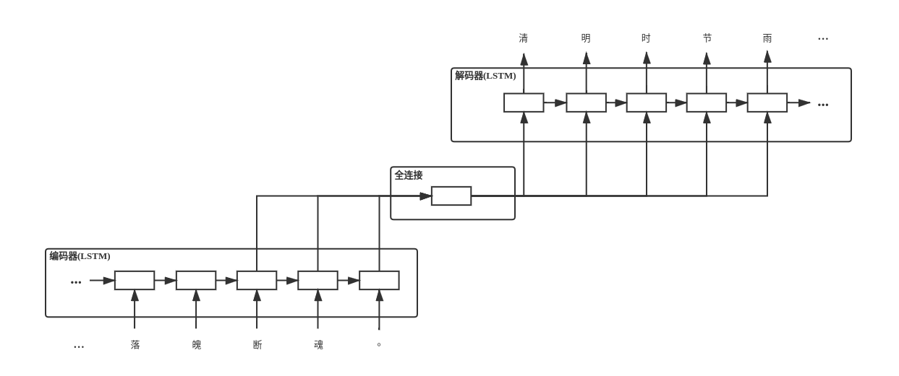
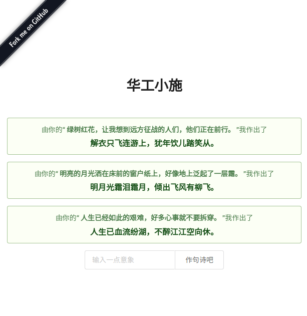

# 小施

基于seq2seq的古诗文翻译模型。



## 安装依赖

```
$ pip3 install -r requirements.txt
```

## 训练模型

> 如果models目录下已有训练好的模型，这一步可以省去。

在./src/目录下，以此运行以下命令：

```
$ python3 -m model.w2v      # 训练w2v
$ python3 -m model.features # 对原始数据进行embedding
$ python3 -m model.seq2seq  # 训练seq2seq
```

经过训练的model会被保存至./models目录下。

Tip: 使用Tensorflow GPU版本，训练会更快喔。

## 运行服务器

```
$ cd ./src
$ python3 server.py
```

## 一些示例

